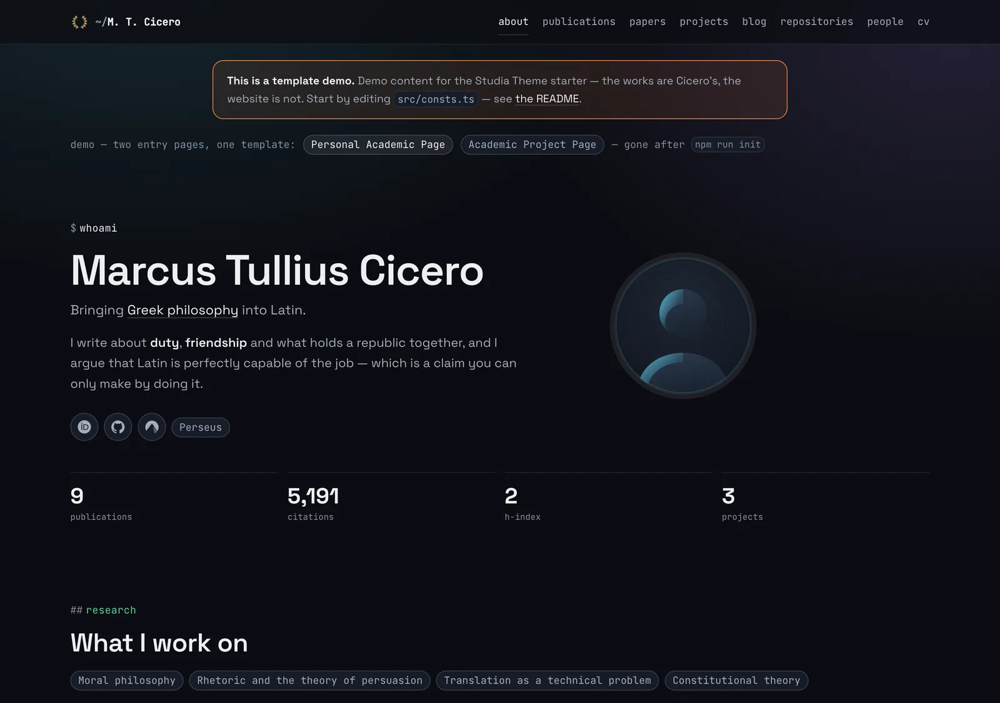

The template behind [the rewrite of this site](/blog/2026/09/13/new-website/) is now reusable: I have published it as **Studia Theme**, an academic website template built with [Astro](https://astro.build/). It is extracted from two production sites, this one and [ardoco.de](https://ardoco.de), which are hand-written in the same style.

The repository is [dfuchss/astro-studia](https://github.com/dfuchss/astro-studia) and it is MIT licensed. There is a [live demo](https://dfuchss.github.io/astro-studia/), and the [documentation](https://github.com/dfuchss/astro-studia/wiki) is the `docs/` folder, one page per file.



## What is in it

Publications parsed from a BibTeX file, a page per paper, projects, a blog, a CV rendered from YAML, people, repositories and a contact page. As on this site, there is no UI framework, no CSS framework and no theme layer, and it is dark only. You edit the source directly; nothing sits between you and the markup.

Two choices carry over from this site:

- **Bad references stop the build.** Venues, authors and paper pages are linked with Astro's `reference()`, so an unknown venue or a BibTeX key pointing at a missing page fails the build and names the offender.
- **`npm run audit` gates the deploy.** It runs over the built output and checks internal links and fragments, canonical URLs, the sitemap and feed, colour contrast, image dimensions, and that nothing is loaded from a third-party origin.

## Two starting points, switchable features

`npm run init` asks which features you want, or takes a preset: `profile` for one person, `project` for a project or group. The presets only pre-tick boxes, and each area is one boolean in `src/features.ts` afterwards. Turning one off deletes nothing; the routes, nav entries and sitemap entries simply disappear.

The text split from the last round of cleanup is in there too. Templates hold layout only, and every word the site prints lives in Markdown files under `src/content/pages`. Your own logo is one command, too: `npm run icons -- path/to/logo.png` writes all the icons the site needs.

## Try it

```bash
npx degit dfuchss/astro-studia my-site
cd my-site && npm install && npm run dev
```

The demo content is placeholder material built around the works of Cicero and is meant to be deleted. The Quickstart page lists what to replace, starting with `SITE.url` in `src/consts.ts`.
