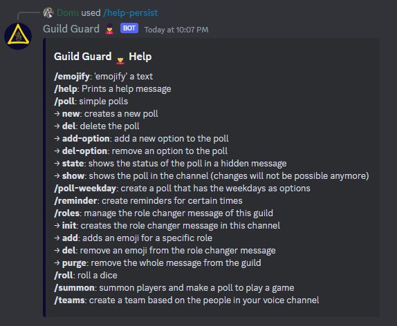
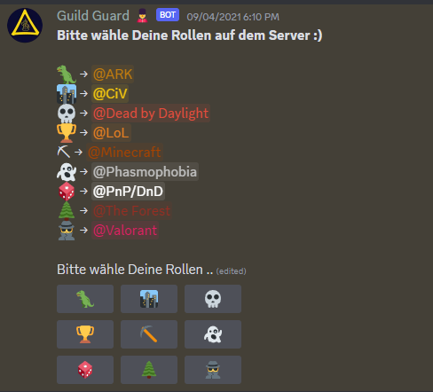

deltabot is my first bot for [Discord](https://discordapp.com/). It previously used [RASA](https://rasa.com/) as a classifier for user input.
It can tell jokes, read RSS feeds to provide news, and more.
The bot includes simple dialog management. The code of the bot is available under GPLv3 via [GitHub](https://github.com/dfuchss/deltabot).

## Functions of deltabot

## User Role Management of deltabot

