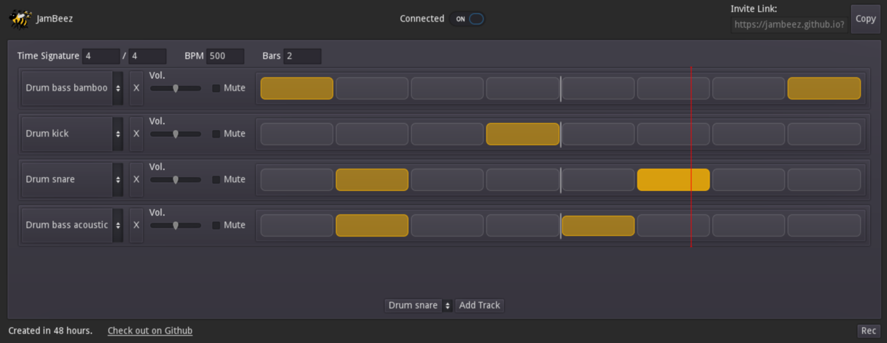

[jambeez](https://github.com/jambeez) is a collaborative drum machine. Version 1 was created within 48 hours during a private coding jam with friends. jambeez allows you to create music together in the browser :)

Server and client code is available at [GitHub](https://github.com/jambeez).

## jambeez User Interface

