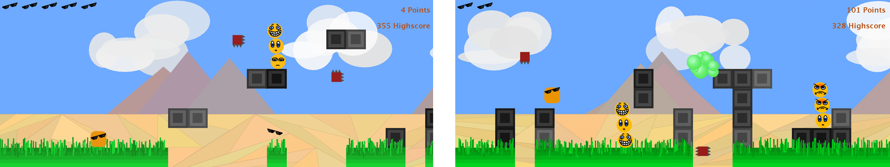
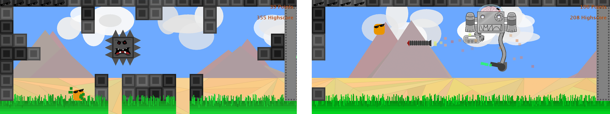

[RεKiT](https://github.com/rekit-group/rekit-game) is a platform jumper game created by three [KIT](https://www.kit.edu/) students in the summer of 2016 with the aim of explaining different design patterns to students in the second semester on the basis of a practical example.

The game is available under GPLv3 via [GitHub](https://github.com/rekit-group/rekit-game) and can be extended to new opponents, special blocks and structures due to the modular approach.

## Infinite Mode

## Boss Rush Mode

