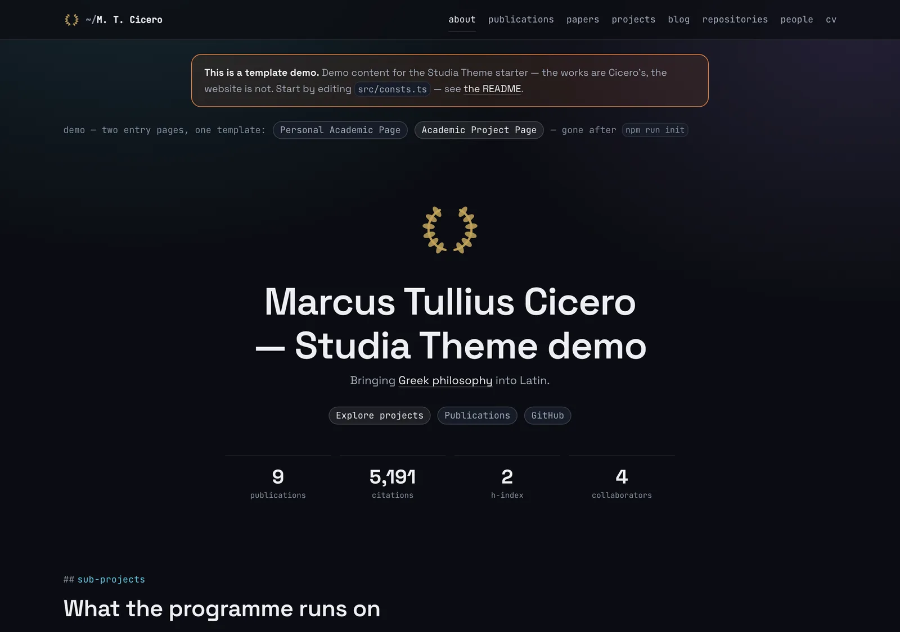
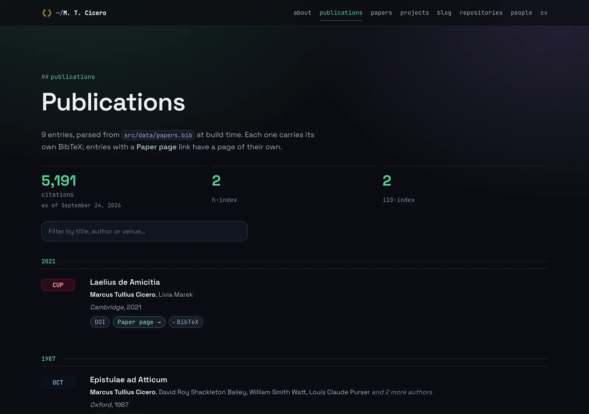

[Studia Theme](https://github.com/dfuchss/astro-studia) is an academic website template built with [Astro](https://astro.build/). It is extracted from two production sites, [fuchss.org](https://fuchss.org) and [ardoco.de](https://ardoco.de), which are hand-written in the same style. It is MIT licensed, and there is a [live demo](https://dfuchss.github.io/astro-studia/) and [documentation](https://github.com/dfuchss/astro-studia/wiki).

## What it is

There is no UI framework, no CSS framework and no theme layer, and the design is dark only. All of it is source you can read and change; there is no package boundary between you and the markup.

- **Publications from BibTeX.** One `papers.bib` is parsed at build time into a typed collection, with venue badges, a page per paper and a CV rendered from YAML.
- **Eight content areas.** Publications, paper pages, projects, a blog, a CV, people, repositories and a contact page. Each one is switched off with a single boolean in `src/features.ts`; nothing is deleted.
- **Two starting points.** `npm run init` sets the flags for a personal page or for a project or group page.
- **References that fail the build.** An unknown venue, a bad slug or a BibTeX key that points at a missing page stops the build and names the offender.
- **A site audit.** `npm run audit` runs over the built output before every deploy and checks links, canonical URLs, the sitemap and feed, contrast, image dimensions and third-party requests.
- **Page text in content files.** Every word the site prints lives in `src/content/pages`, not in the templates.
- **Icons from one image.** `npm run icons -- path/to/logo.png` writes the favicon, the Apple touch icon and the 512px app icon.






## Using it

```bash
npx degit dfuchss/astro-studia my-site
cd my-site && npm install && npm run dev
```

The demo content is placeholder material built around the works of Cicero and is meant to be deleted. For the background, see the post [Studia Theme, the template behind this site](/blog/2026/10/05/studia-theme/).
