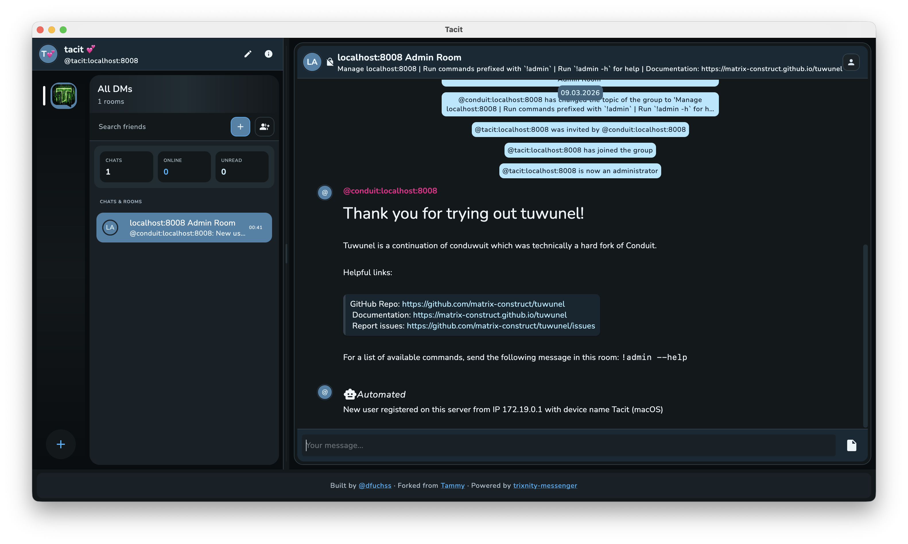
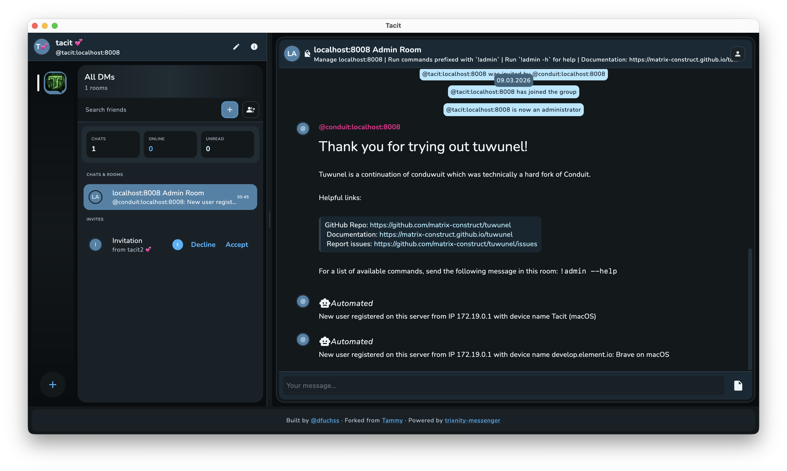
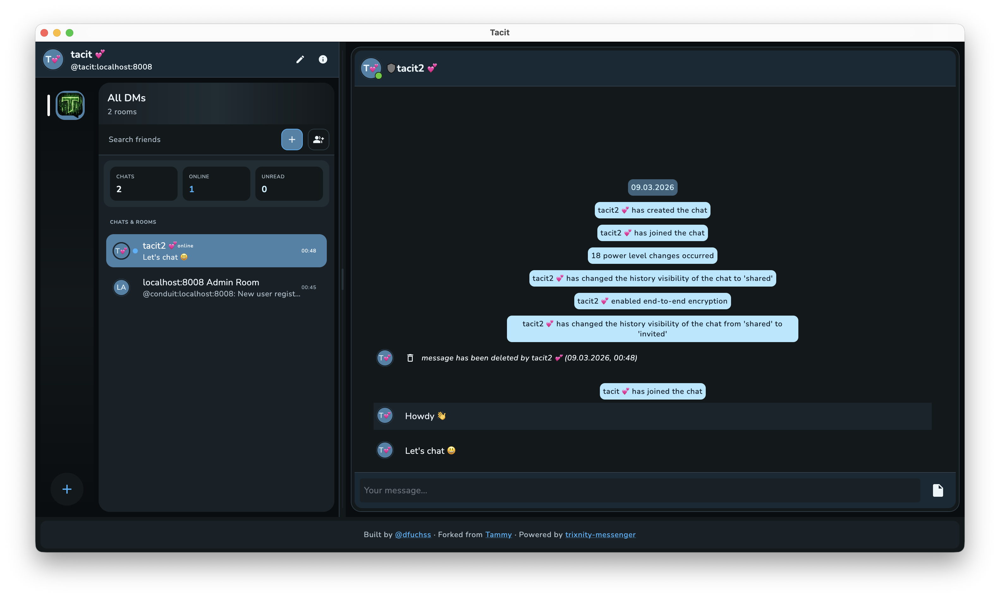
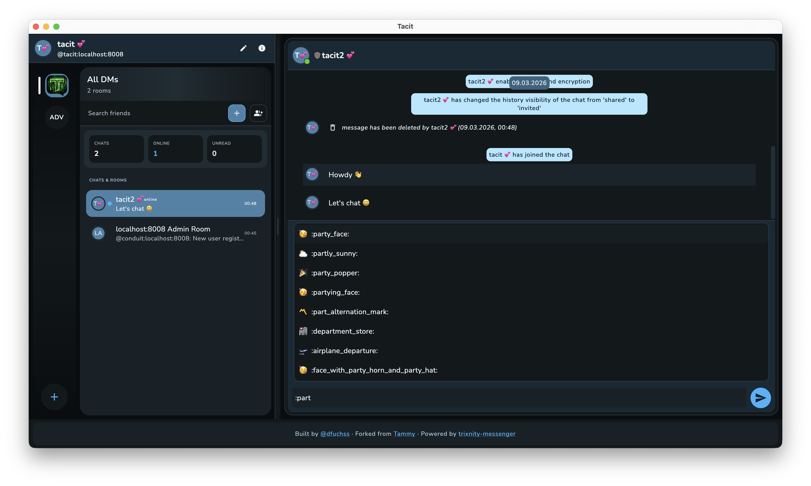
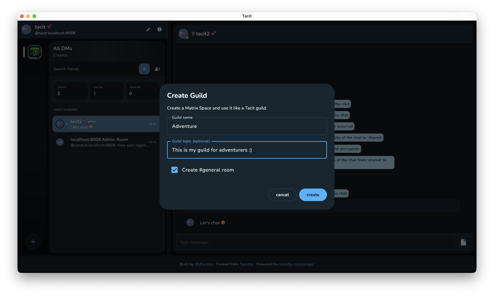
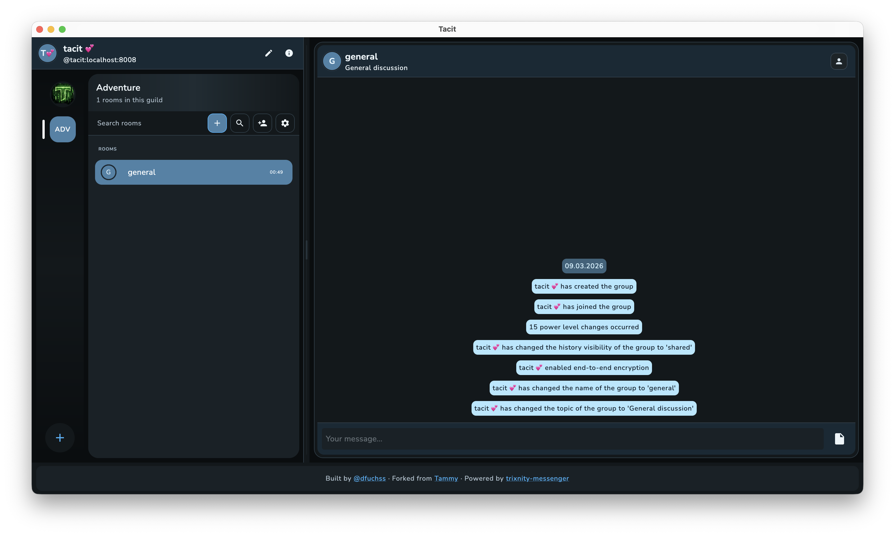
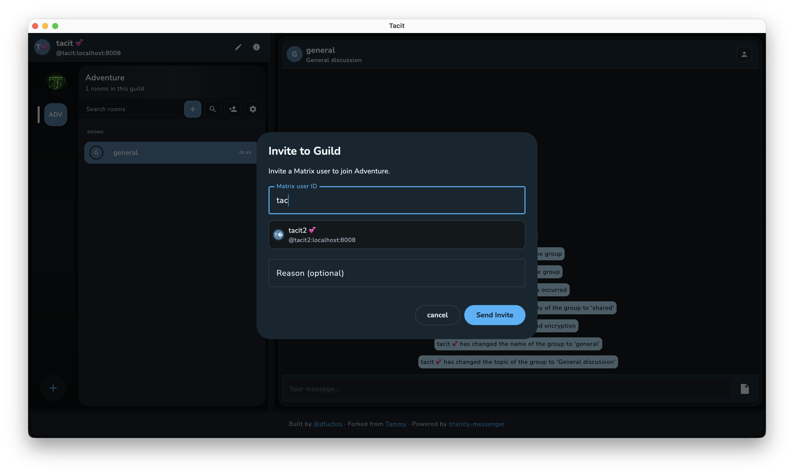
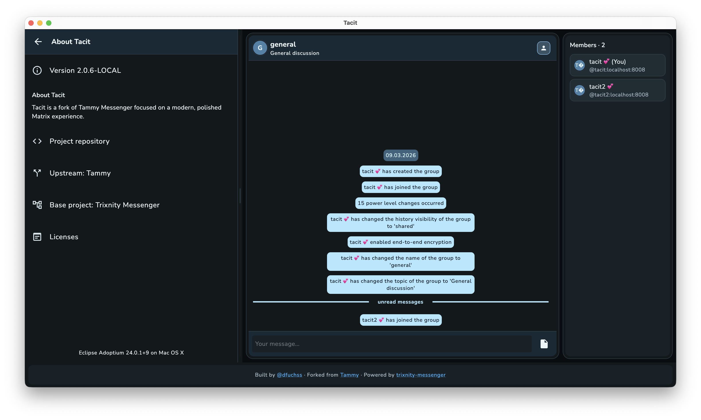

[Tacit](https://gitlab.com/dfuchss/tacit) is a Matrix messenger with a strong focus on modern interaction patterns and a clean workflow for spaces, channels, DMs, and groups.
It is a fork of [Tammy](https://gitlab.com/connect2x/tammy) and is built on top of [trixnity-messenger](https://gitlab.com/connect2x/trixnity-messenger/trixnity-messenger), with the UI/UX adapted for a more focused, desktop-first experience.

## Highlights

- Modern guild/space and channel navigation
- Don't reinvent the wheel: build on top of strong existing libraries and frameworks (trixnity, trixnity-messenger, tammy)
- Optimized for daily desktop/web usage

### DMs / Group Chats

### Invites

### Chatting

### Emoji picker while typing :)

### Spaces / Guilds

A matrix space is translated to the idea of guilds in Tacit. Guilds only contain rooms. All DMs and group chats are outside of guilds. Guilds can be used to organize rooms, e.g. by topic, project, or team.

#### Create your guilds

#### Guild overview

#### Invite to guild

### About

## Project Links

- Source code: [dfuchss/tacit](https://gitlab.com/dfuchss/tacit)
- Forked from Tammy: [connect2x/tammy](https://gitlab.com/connect2x/tammy)
- Based on trixnity-messenger: [connect2x/trixnity-messenger](https://gitlab.com/connect2x/trixnity-messenger/trixnity-messenger)
